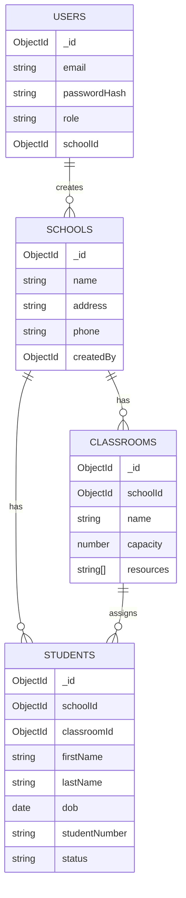

# School Management System API (Axion Template)

This repository extends the provided Soar **Axion** template to deliver the requested **School Management System REST API** with:

- JWT authentication
- Role-based access control (RBAC)
- MongoDB persistence (Mongoose)
- Input validation and consistent error responses
- Rate limiting and basic security headers
- Test suite (Jest + Supertest)

The original template's generic `/api/:moduleName/:fnName` handler remains intact.
The School Management System is exposed via `/v1` endpoints.

## Roles and permissions

| Role | Scope | Allowed |
|---|---|---|
| `SUPERADMIN` | System-wide | Manage all schools, create school admins, transfer students |
| `SCHOOL_ADMIN` | One school only | Manage classrooms and students inside assigned school |

## Tech stack

- Node.js + Express
- MongoDB + Mongoose
- JWT (Authorization: `Bearer <token>`)

## Quick start (local)

1. Install deps

```bash
npm install
```


2. Running MongoDB locally

Using Docker:
```bash
docker run -d --name sms-mongo -p 27017:27017 mongo:7
```

3. Run the server

```bash
npm run dev
```

Server listens on `USER_PORT` (default `5111`).

Health check:

```bash
curl http://localhost:5111/health
```

## Authentication flow

### 1) Create the first superadmin (bootstrap)

`POST /v1/auth/register-superadmin`

```json
{ "email": "sa@example.com", "password": "password123" }
```

Returns `{ token, user }`.

> This endpoint is allowed **only once** (it refuses if a superadmin already exists).

### 2) Login

`POST /v1/auth/login`

```json
{ "email": "sa@example.com", "password": "password123" }
```

Use the returned token:

`Authorization: Bearer <token>`

## REST API endpoints (v1)

### Schools (SUPERADMIN)

- `POST /v1/schools`
- `GET /v1/schools`
- `GET /v1/schools/:id`
- `PUT /v1/schools/:id`
- `DELETE /v1/schools/:id`

Create a school admin for a given school:

- `POST /v1/schools/:schoolId/admins`

### Classrooms (SUPERADMIN or SCHOOL_ADMIN scoped)

- `POST /v1/schools/:schoolId/classrooms`
- `GET /v1/schools/:schoolId/classrooms`
- `GET /v1/schools/:schoolId/classrooms/:classroomId`
- `PUT /v1/schools/:schoolId/classrooms/:classroomId`
- `DELETE /v1/schools/:schoolId/classrooms/:classroomId`

### Students (SUPERADMIN or SCHOOL_ADMIN scoped)

- `POST /v1/schools/:schoolId/students`
- `GET /v1/schools/:schoolId/students` (supports `?q=` search)
- `GET /v1/schools/:schoolId/students/:studentId`
- `PUT /v1/schools/:schoolId/students/:studentId`
- `DELETE /v1/schools/:schoolId/students/:studentId`

Enroll/unassign classroom:

- `POST /v1/schools/:schoolId/students/:studentId/enroll`

Transfer across schools (SUPERADMIN):

- `POST /v1/schools/:schoolId/students/:studentId/transfer`

## Error format

Errors are returned as:

```json
{
  "ok": false,
  "error": {
    "code": "VALIDATION_ERROR",
    "message": "Invalid input",
    "details": [
      { "field": "email", "message": "Invalid email" }
    ]
  }
}
```

Common status codes:

- `400` validation
- `401` unauthorized
- `403` forbidden
- `404` not found
- `409` duplicate/exists
- `429` rate limited

## Database schema

### Collections

- `users`
- `schools`
- `classrooms`
- `students`

### Diagram (Mermaid)



## Tests

Run unit/integration tests (uses in-memory MongoDB):

```bash
npm test
```

## Deployment instructions

### Option A: Render / Railway / Fly.io

1. Provision a MongoDB instance (Atlas or provider-managed)
2. Set env vars (see `.env.example`)
3. Deploy with start command:

```bash
npm start
```

### Option B: Docker

Example `Dockerfile` (not included to keep template minimal):

```dockerfile
FROM node:20-alpine
WORKDIR /app
COPY package*.json ./
RUN npm ci --omit=dev
COPY . .
EXPOSE 5111
CMD ["npm","start"]
```

## Notes / Assumptions

- **Transfers** across schools are restricted to `SUPERADMIN` to avoid cross-school privilege escalation.
- Rate limiting is implemented in-memory for simplicity. In production, swap to Redis for shared limits.

### Author
Moataz Hamdan
Soar Backend Engineer Technical Challenge