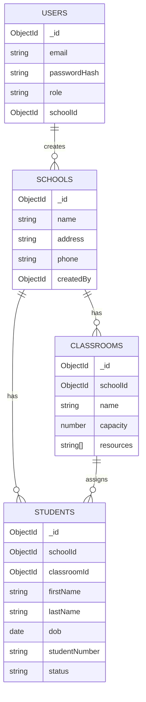

# School Management System API (Axion Template)

This repository extends the provided **Soar Axion** backend template to implement a complete **School Management System REST API**.

The implementation focuses on clarity, security, and production readiness while preserving the original Axion architecture and the generic `/api/:moduleName/:fnName` handler.

The School Management System is exposed through dedicated versioned endpoints under `/v1`.

---

## Features

- JWT-based authentication
- Role-based access control (RBAC)
- MongoDB persistence using Mongoose (Atlas-compatible)
- Redis-backed cache/state/streaming (Upstash-compatible with TLS)
- Input validation and consistent error responses
- Rate limiting and basic security headers
- Health check endpoint for deployment verification
- Test-ready structure (Jest + Supertest)

---

## Live Deployment (Render)

**Render URL:**
```
https://school-management-system-api-8xcf.onrender.com
```

### Free Tier Cold Start Notice

Render **free** web services may **sleep when idle**.  
The first request after inactivity can take **~20–60 seconds** to respond while the service initializes.

---

## Health Check

```
GET /health
```

Expected response:
```json
{ "ok": true, "service": "axion" }
```

---

## Roles and Permissions

| Role | Scope | Capabilities |
|------|------|--------------|
| `SUPERADMIN` | System-wide | Manage all schools, create school admins, transfer students |
| `SCHOOL_ADMIN` | Single school | Manage classrooms and students within assigned school |

---

## Tech Stack

- Node.js + Express
- MongoDB + Mongoose
- Redis (TLS via `rediss://` for hosted providers)
- JWT (Authorization: `Bearer <token>`)

---

## Environment Variables (.env)

The application is configured using environment variables in `.env` (locally) or Render Environment settings (production).

### What each variable does

#### App
- `SERVICE_NAME` — Used in logs and `/health` response
- `ENV` — Environment label (e.g., `development`, `production`)
- `USER_PORT` — HTTP port the server listens on (Render typically sets `PORT`; if the template uses `USER_PORT`, set it in Render)
- `ADMIN_PORT` — Reserved by template (not required for `/v1`)

#### MongoDB
- `MONGO_URI` — MongoDB connection string (Atlas or local). Includes the DB name at the end of the URI.

#### Redis
- `CACHE_REDIS` — Redis URL used by cache layer
- `CACHE_PREFIX` — Prefix namespace for cache keys
- `CORTEX_REDIS` — Redis URL used by Cortex (state/events)
- `CORTEX_PREFIX` — Prefix namespace for Cortex
- `CORTEX_TYPE` — Cortex storage type (per template)
- `OYSTER_REDIS` — Redis URL used by Oyster DB layer
- `OYSTER_PREFIX` — Prefix namespace for Oyster keys

> For hosted Redis (e.g., Upstash), use `rediss://` to enable TLS.

#### Auth / Security
- `LONG_TOKEN_SECRET`, `SHORT_TOKEN_SECRET`, `NACL_SECRET`, `JWT_SECRET` — Cryptographic secrets (use strong random values in production)
- `JWT_EXPIRES_IN` — JWT lifetime (e.g., `1h`)

---

## Local Quick Start

1) Install dependencies
```bash
npm install
```

2) Run MongoDB locally (Docker)
```bash
docker run -d --name sms-mongo -p 27017:27017 mongo:7
```

3) Run Redis locally (Docker)
```bash
docker run -d --name sms-redis -p 6379:6379 redis:7
```

4) Create `.env` and start the server
```bash
npm run dev
```

Server listens on `USER_PORT` (default `5111`).

---

## Authentication Flow (Reviewer Guide)

### 1) Bootstrap the first SUPERADMIN (only once)

`POST /v1/auth/register-superadmin`

Request body:
```json
{ "email": "sa@example.com", "password": "Password123!" }
```

Notes:
- This endpoint is intended to be used **once** to create the first SUPERADMIN.
- After a SUPERADMIN exists, it refuses further bootstrap attempts.

### 2) Login

`POST /v1/auth/login`

Request body:
```json
{ "email": "sa@example.com", "password": "Password123!" }
```

Use the returned token on future requests:
```
Authorization: Bearer <token>
```

---

## REST API Endpoints (v1)

### Schools (SUPERADMIN)

- `POST /v1/schools`
- `GET /v1/schools`
- `GET /v1/schools/:id`
- `PUT /v1/schools/:id`
- `DELETE /v1/schools/:id`

Create a school admin (SUPERADMIN only):
- `POST /v1/schools/:schoolId/admins`

### Classrooms (SUPERADMIN or SCHOOL_ADMIN scoped)

- `POST /v1/schools/:schoolId/classrooms`
- `GET /v1/schools/:schoolId/classrooms`
- `GET /v1/schools/:schoolId/classrooms/:classroomId`
- `PUT /v1/schools/:schoolId/classrooms/:classroomId`
- `DELETE /v1/schools/:schoolId/classrooms/:classroomId`

### Students (SUPERADMIN or SCHOOL_ADMIN scoped)

- `POST /v1/schools/:schoolId/students`
- `GET /v1/schools/:schoolId/students` (supports `?q=` search)
- `GET /v1/schools/:schoolId/students/:studentId`
- `PUT /v1/schools/:schoolId/students/:studentId`
- `DELETE /v1/schools/:schoolId/students/:studentId`

Enroll/unassign classroom:
- `POST /v1/schools/:schoolId/students/:studentId/enroll`

Transfer across schools (SUPERADMIN):
- `POST /v1/schools/:schoolId/students/:studentId/transfer`

---

## Error Format

Errors are returned as:
```json
{
  "ok": false,
  "error": {
    "code": "VALIDATION_ERROR",
    "message": "Invalid input",
    "details": [
      { "field": "email", "message": "Invalid email" }
    ]
  }
}
```

Common status codes:
- `400` validation
- `401` unauthorized
- `403` forbidden
- `404` not found
- `409` duplicate/exists
- `429` rate limited

---

## Database Schema

### Collections
- `users`
- `schools`
- `classrooms`
- `students`

### Diagram (Mermaid)


---

## Tests

Run tests:
```bash
npm test
```

---

## Notes / Assumptions

- Transfers across schools are restricted to `SUPERADMIN` to prevent cross-school privilege escalation.
- Rate limiting is implemented in-memory for simplicity; in production, use shared storage if horizontally scaling.
- Hosted Redis providers typically require TLS (`rediss://`).

---

## Author

Moataz Hamdan  
Soar Backend Engineer Technical Challenge
